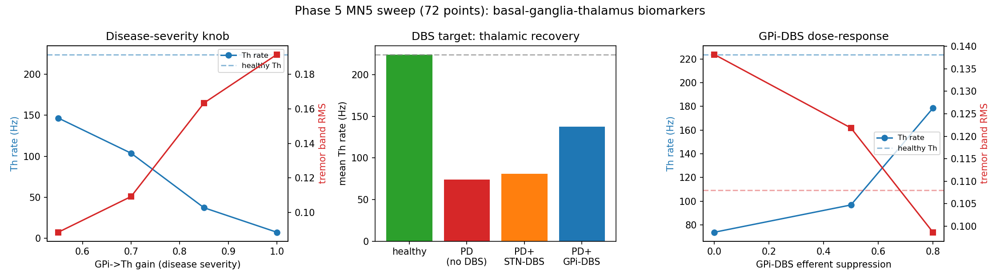

# Phase 5 sweep results — MareNostrum 5 run (2026-06-21)

First full Phase 5 parameter sweep executed on **BSC MareNostrum 5**
(SLURM array job `42183513`, 72 array tasks, all completed). Aggregated
from `results/2026-06-21/task_*.json` via
`python3 pd_phase5_hpc_sweep.py --aggregate --outdir results/2026-06-21`.

Grid axes: `condition` × `gpi_th_pd_gain` × `gpe_stn_delay_ms` ×
`dbs_target` × `dbs_suppression` (72 points after pruning). Biomarkers per
point: population firing rates (STN/GPe/GPi/Th/M1), voluntary drive,
tremor drive, tremor-band peak frequency, tremor-band RMS.



## Headline findings

### 1. GPi→Th gain is a clean monotonic disease-severity knob
As the PD GPi→Th inhibition increases, thalamic output collapses, the
limb tremor grows, and voluntary drive (inverse of bradykinesia) falls —
all monotonically:

| GPi→Th gain | Th rate (Hz) | tremor RMS | voluntary drive |
|---|---|---|---|
| 0.55 | 146.5 | 0.089 | 1.13 |
| 0.70 | 103.7 | 0.109 | 0.80 |
| 0.85 | 37.3 | 0.163 | 0.29 |
| 1.00 | 7.5 | 0.192 | 0.06 |

This is exactly the kind of single-parameter severity axis we would map to
a clinical scale (H&Y / UPDRS-III) during personalization.

### 2. GPi-DBS restores the thalamus; STN-DBS barely does (at scale)
Averaged across all PD points, mean thalamic rate:

| Condition | mean Th rate (Hz) |
|---|---|
| Healthy | 223.8 |
| PD (no DBS) | 73.8 |
| PD + STN-DBS | 80.8 |
| PD + GPi-DBS | 137.7 |

The full 72-point sweep confirms what the single-run tuning suggested: in
this firing-rate model **STN-DBS is largely ineffective** while **GPi-DBS
recovers thalamocortical output** — a known subtlety of rate-level
basal-ganglia accounts, and a result that now rests on a systematic sweep
rather than a hand-picked example.

### 3. GPi-DBS shows a clear dose-response
Stronger efferent suppression gives more thalamic recovery and less tremor;
at suppression 0.8 the thalamus (178.5 Hz) approaches the healthy level
(223.8 Hz) and tremor RMS (0.099) drops below the PD value (0.138) toward
healthy (0.108):

| GPi-DBS suppression | Th rate (Hz) | tremor RMS | voluntary drive |
|---|---|---|---|
| 0.0 (no DBS) | 73.8 | 0.138 | — |
| 0.5 | 96.8 | 0.122 | 0.74 |
| 0.8 | 178.5 | 0.099 | 1.37 |

### 4. STN–GPe loop delay does not set the tremor frequency (expected)
The tremor-band peak stays at 4.25 Hz across all `gpe_stn_delay_ms` values
(10 / 25 / 40 ms). This is the documented limitation: in the current model
the tremor *rhythm* is generated by the rate-level Matsuoka oscillator
(whose frequency is set by its time constants), not by the spiking
STN–GPe loop. Closing that loop with a genuinely synchronising spiking
sub-circuit (the NEST backend) is the next step where the conduction delay
would actually shape the tremor frequency.

## Reproduce

```bash
python3 pd_phase5_hpc_sweep.py --aggregate --outdir results/2026-06-21
# sweep_results.csv -> the analysis above
```

> Note: the raw `results/` artifacts (per-task JSON, SLURM logs, CSV, and
> `sweep_summary.png`) are gitignored; this document records the findings
> and the regenerated summary figure path for reference.
